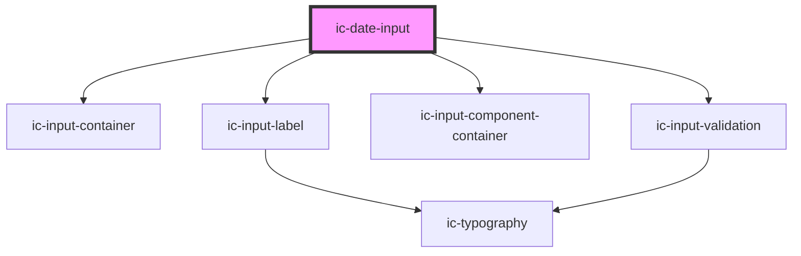

# ic-date-input

<!-- Auto Generated Below -->

## Properties

| Property             | Attribute             | Description                                                                                                               | Type                                           | Default        |
| -------------------- | --------------------- | ------------------------------------------------------------------------------------------------------------------------- | ---------------------------------------------- | -------------- |
| `dateDisplayFormat`  | `date-display-format` | The format in which the date will be displayed.                                                                           | `"DD/MM/YYYY" \| "MM/DD/YYYY" \| "YYYY/MM/DD"` | `"DD/MM/YYYY"` |
| `helperText`         | `helper-text`         | The helper text that will be displayed for additional field guidance. This will default to the `dateDisplayFormat` value. | `string`                                       | `undefined`    |
| `label` _(required)_ | `label`               | The label for the date input.                                                                                             | `string`                                       | `undefined`    |
| `validationStatus`   | `validation-status`   | The validation state - e.g. 'error' \| 'warning' \| 'success'. This will override the built-in date validation.           | `"" \| "error" \| "success" \| "warning"`      | `""`           |
| `validationText`     | `validation-text`     | The text to display as the validation message. This will override the built-in date validation.                           | `string`                                       | `""`           |
| `value`              | `value`               | The value of the date input - in ISO 8601 date string format (`yyyy-mm-dd`). OR DATE OBJECT                               | `string`                                       | `""`           |

## Dependencies

### Depends on

- [ic-input-container](../ic-input-container)
- [ic-input-label](../ic-input-label)
- [ic-input-component-container](../ic-input-component-container)
- [ic-input-validation](../ic-input-validation)

### Graph

----------------------------------------------

